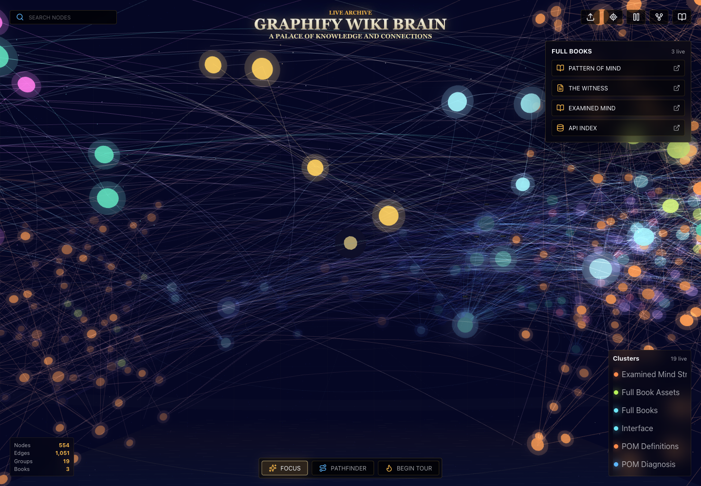

# Graphify Wiki Brain

Public Three.js brain viewer for [Graphify](https://github.com/safishamsi/graphify), GitHub wiki exports, and [Obsidian](https://obsidian.md/) vaults.

This repo is intentionally static. You build or import a graph locally, write `public/brain.json`, and the site renders that graph as a full-screen interactive brain. The same data is also exposed as static JSON under `public/api/`.

The default graph includes the archive-derived Pattern of Mind and State of Mind layers. Provenance and source notes live in [docs/mind-graph-sources.md](docs/mind-graph-sources.md).

> **AUKS redesign (in progress):** a detailed, public AUKS brain that carries the full senn-archive node/edge schema, source-linked nodes, relational connections, and multi-identity agents with shared-memory settings. See the design spec in [docs/auks-public-brain-design.md](docs/auks-public-brain-design.md), the full **API design** in [docs/auks-public-brain-api.md](docs/auks-public-brain-api.md) (+ OpenAPI 3.1 at [schema/auks-brain-api.openapi.yaml](schema/auks-brain-api.openapi.yaml)), the data schema in [schema/auks-brain.schema.json](schema/auks-brain.schema.json), TypeScript types in [src/types/auks.ts](src/types/auks.ts), and a worked example in [public/examples/auks-example-brain.json](public/examples/auks-example-brain.json).

[](public/public-domain/screenshots/graphify-wiki-brain-updated-node-graph.png)

[Open the updated node graph capture](public/public-domain/screenshots/graphify-wiki-brain-updated-node-graph.png)

## What This Repo Does

Use this repo when you want a public brain view of one of these sources:

- A Graphify project graph: `graphify-out/graph.json`
- An Obsidian vault: markdown notes with wikilinks, markdown links, tags, and folders
- A curated public-domain package under `docs/public-domain/` and `public/public-domain/`
- Full public book artifacts under `public/books/`

The core flow is:

```bash
# 1. Build a graph somewhere else with Graphify.
graphify extract /path/to/project --out /path/to/project

# 2. Import Graphify's graph into this brain viewer.
npm run import:graphify -- /path/to/project/graphify-out/graph.json

# 3. Validate and publish the static API.
npm run validate:data
npm run build:api
npm run dev
```

## Important Links

- [Graphify](https://github.com/safishamsi/graphify) - turns code, docs, schemas, media, and notes into a queryable knowledge graph.
- [Graphify install instructions](https://github.com/safishamsi/graphify#install)
- [Graphify command reference](https://github.com/safishamsi/graphify#usage)
- [Claude Code docs](https://code.claude.com/docs/en/overview)
- [OpenAI Codex docs](https://developers.openai.com/codex)
- [Obsidian](https://obsidian.md/)
- [Obsidian Help](https://obsidian.md/help)
- [Obsidian internal links and wikilinks](https://obsidian.md/help/links)
- [GitHub wikis docs](https://docs.github.com/en/communities/documenting-your-project-with-wikis/about-wikis)
- [GitHub Pages docs](https://docs.github.com/en/pages)

## Install This Viewer

Requirements:

- [Node.js](https://nodejs.org/) 20 or newer
- npm

```bash
git clone https://github.com/nathansenn/graphify-wiki-brain.git
cd graphify-wiki-brain
npm install
npm run dev
```

Build and preview the production site:

```bash
npm run build
npm run preview
```

## Install Graphify

Requirements for Graphify:

- [Python](https://www.python.org/downloads/) 3.10 or newer
- Either [uv](https://docs.astral.sh/uv/) or [pipx](https://pipx.pypa.io/)

Recommended install:

```bash
uv tool install graphifyy
graphify --version
graphify install
```

The PyPI package is `graphifyy`. The command is still `graphify`.

Alternative installs:

```bash
pipx install graphifyy
pip install graphifyy
```

Useful extras for conversion-heavy corpora:

```bash
# Office files such as .docx and .xlsx
uv tool install "graphifyy[office]"

# PDFs
uv tool install "graphifyy[pdf]"

# Video and audio
uv tool install "graphifyy[video]"

# Most optional extractors
uv tool install "graphifyy[all]"
```

If a Graphify command shown below is missing, upgrade first:

```bash
uv tool upgrade graphifyy
graphify install
```

## Map Code To Graphify

Run this from the project you want to understand:

```bash
cd /path/to/your/project
graphify extract . --out .
```

Graphify writes:

```text
graphify-out/
  graph.html       # interactive local graph
  graph.json       # durable machine-readable graph
  GRAPH_REPORT.md  # human-readable architecture and insight report
  obsidian/        # Obsidian vault output when requested
  wiki/            # markdown wiki output when requested
  cache/           # extraction cache
```

For normal daily code changes, use the faster code refresh:

```bash
graphify update .
```

After large refactors or deleted files, force a clean graph write:

```bash
graphify update . --force
```

For very large graphs where `graph.html` is too heavy:

```bash
graphify cluster-only . --no-viz
```

Ask the graph questions without re-reading the whole codebase:

```bash
graphify query "what connects auth to the database?"
graphify explain "RateLimiter"
graphify path "UserService" "DatabasePool"
```

## Map Graphify To This Brain

After Graphify creates `graphify-out/graph.json`, import it here:

```bash
cd /path/to/graphify-wiki-brain
npm run import:graphify -- /path/to/your/project/graphify-out/graph.json
npm run validate:data
npm run build:api
npm run dev
```

That writes:

- `public/brain.json` - the graph rendered by the Three.js brain viewer
- `public/api/brain.json` - the same graph as a static API endpoint
- `public/api/index.json` - endpoint discovery
- `public/api/summary.json` - compact counts
- `public/api/books.json` - book metadata when public books are present

Use a custom output path if you want to test without replacing the current public graph:

```bash
npm run import:graphify -- /path/to/graphify-out/graph.json /tmp/brain.json
npm run validate:data -- /tmp/brain.json
```

## Map Obsidian To This Brain

This repo can import an Obsidian vault directly. It reads:

- Markdown files
- Wikilinks such as `[[Design Notes]]`
- Markdown links to local `.md` files
- Tags such as `#architecture`
- Top-level folders as groups

```bash
cd /path/to/graphify-wiki-brain
npm run import:obsidian -- /path/to/ObsidianVault
npm run validate:data
npm run build:api
npm run dev
```

Obsidian naming tips:

- Use stable note names. The importer resolves links by relative path and basename.
- Prefer wikilinks or relative markdown links between notes.
- Keep private vault content out of a public repo unless you have reviewed it.
- Ignore `.obsidian/`, `.git/`, and `node_modules/`; the importer already skips them.

## Generate Obsidian From Graphify

Graphify can also generate an Obsidian-friendly vault from a source corpus. From an agent, run:

```text
/graphify . --obsidian
```

The generated vault lives at `graphify-out/obsidian/`. If your installed shell CLI exposes an equivalent `--obsidian` option in `graphify --help`, you can use it there too; otherwise run this from Claude Code, Codex, or another assistant after installing the Graphify skill.

Then open `graphify-out/obsidian/` as an Obsidian vault. You can also import that generated vault back into this viewer:

```bash
npm run import:obsidian -- /path/to/project/graphify-out/obsidian
npm run validate:data
npm run build:api
```

## Install Graphify Into Agents

Graphify works best when the agent knows to query `graphify-out/graph.json` before grepping or rereading the entire repo.

Global install for detected assistants:

```bash
graphify install
```

Project-scoped install for files you can commit with the repo:

```bash
graphify install --project
```

Common platform installs:

```bash
# Claude Code
graphify claude install

# Codex
graphify codex install

# OpenCode
graphify opencode install

# Cursor
graphify cursor install

# Gemini CLI
graphify gemini install

# VS Code Copilot Chat
graphify vscode install

# GitHub Copilot CLI
graphify copilot install
```

Current Graphify also supports platform selection through:

```bash
graphify install --platform codex
graphify install --platform opencode
graphify install --platform cursor
graphify install --platform gemini
```

Codex note:

- Codex uses `$graphify` instead of `/graphify`.
- Add this to `~/.codex/config.toml` if your Codex install requires multi-agent skills:

```toml
[features]
multi_agent = true
```

Claude Code note:

- Claude Code uses `/graphify`.
- The Claude integration writes Graphify guidance into Claude's instruction surface and can install a pre-tool hook.

Agent usage after install:

```text
/graphify .
/graphify query "where does user auth touch persistence?"
/graphify explain "BrainScene"
```

In Codex:

```text
$graphify .
$graphify query "where does user auth touch persistence?"
```

## Install Git Hooks

Use Graphify's git hooks when you want the graph to stay current after commits and checkouts:

```bash
cd /path/to/your/project
graphify hook install
graphify hook status
```

This installs local `.git/hooks` entries. They are not committed by default. The hooks can:

- Rebuild or refresh the graph after commits
- Refresh after checkout
- Configure Graphify's merge driver for `graphify-out/graph.json`

Remove hooks:

```bash
graphify hook uninstall
```

Use a long-running watcher instead of hooks when several agents are editing files before commits:

```bash
graphify watch .
```

## Create A Graphify Wiki

Graphify can generate an agent-readable markdown wiki:

```text
/graphify . --wiki
```

If your installed shell CLI exposes an equivalent `--wiki` option in `graphify --help`, you can use it there too; otherwise run this from Claude Code, Codex, or another assistant after installing the Graphify skill.

Graphify writes the generated wiki under `graphify-out/wiki/`. The entry point is `graphify-out/wiki/index.md`.

Use it locally:

```bash
ls graphify-out/wiki
sed -n '1,160p' graphify-out/wiki/index.md
```

Point an agent at:

```text
graphify-out/wiki/index.md
```

Then ask it to navigate the wiki pages instead of reading raw code first.

## Publish The Wiki To GitHub

GitHub wikis are separate git repositories named `OWNER/REPO.wiki.git`.

First, make sure wiki support is enabled in the GitHub repo settings. If GitHub has never created the wiki backing repo before, create the first page in the GitHub web UI once. After that, the `.wiki.git` remote can be pushed normally.

Publish a generated Graphify wiki:

```bash
OWNER=nathansenn
REPO=graphify-wiki-brain
WIKI_SRC=/path/to/your/project/graphify-out/wiki

git clone git@github.com:$OWNER/$REPO.wiki.git /tmp/$REPO.wiki
rsync -av --delete "$WIKI_SRC/" /tmp/$REPO.wiki/
cd /tmp/$REPO.wiki
git add .
git commit -m "Update project wiki"
git push
```

If your generated wiki uses `index.md`, rename or copy it to `Home.md` for GitHub wiki landing pages:

```bash
cp index.md Home.md
git add Home.md
git commit -m "Add wiki home page"
git push
```

## Publish This Brain To GitHub Pages

This repo is configured as a static app. The normal release path is:

```bash
npm run validate:data
npm run build:api
npm run build
git add public/brain.json public/api README.md
git commit -m "Update brain graph"
git push origin main
```

Then GitHub Actions builds and deploys the site to GitHub Pages.

## Public Domain Package

The public-safe release package lives in `docs/public-domain/` and `public/public-domain/`.

- [Markdown reports](docs/public-domain/reports/)
- [HTML diagrams](public/public-domain/html/)
- [PDF exports](public/public-domain/pdf/)
- [JSON source indexes](public/public-domain/sources/)
- Smoke-test screenshots: [desktop](public/public-domain/screenshots/graphify-wiki-brain-public-smoke.png), [narrow](public/public-domain/screenshots/graphify-wiki-brain-public-narrow.png)
- [Updated node graph capture](public/public-domain/screenshots/graphify-wiki-brain-updated-node-graph.png)

Regenerate the sanitized package with:

```bash
node scripts/build-public-domain-brain-package.mjs
```

## Full Public Books

Full book artifacts live in `public/books/` and are mapped into `public/brain.json`.

- [The Pattern of Mind full HTML](public/books/pattern-of-mind/The-Pattern-of-Mind-BOOK.html)
- [The Witness full HTML](public/books/the-witness/the-witness.html)
- [The Examined Mind original DOCX](public/books/the-examined-mind/The_Examined_Mind.docx)
- [The Examined Mind reader HTML](public/books/the-examined-mind/the-examined-mind.html)
- [Full book manifest](public/books/books.manifest.json)

After regenerating the public-domain package, remap the full books with:

```bash
npm run map:books
```

## Static API

The public API layer is served as static JSON from `public/api/`.

- [Endpoint discovery](public/api/index.json)
- [Complete graph payload](public/api/brain.json)
- [Full book manifest with graph node ids](public/api/books.json)
- [Compact graph and book counts](public/api/summary.json)

Refresh only the API files with:

```bash
npm run build:api
```

## Brain Schema

This is the normalized graph format consumed by the viewer:

```json
{
  "name": "My Brain",
  "nodes": [
    {
      "id": "note:build-log",
      "label": "Build Log",
      "group": "Projects",
      "kind": "note",
      "summary": "Short preview",
      "path": "Projects/Build Log.md",
      "tags": ["build"]
    }
  ],
  "edges": [
    {
      "source": "note:build-log",
      "target": "tag:build",
      "label": "tagged"
    }
  ]
}
```

Optional node fields include `url`, `weight`, `color`, `x`, `y`, and `z`.

The Graphify importer accepts common `nodes` plus `edges` or `links` JSON shapes and normalizes them into this schema.

## Troubleshooting

`graphify: command not found`

```bash
uv tool install graphifyy
# or
pipx install graphifyy
```

Graphify command shown here is missing:

```bash
uv tool upgrade graphifyy
graphify install
graphify --help
```

Brain viewer has stale data:

```bash
npm run import:graphify -- /path/to/graphify-out/graph.json
npm run validate:data
npm run build:api
```

Graph has old nodes after a refactor:

```bash
graphify update . --force
```

Graph HTML is too large:

```bash
graphify cluster-only . --no-viz
graphify query "what are the central modules?"
```

GitHub wiki push says repository not found:

- Confirm the main repo has wiki support enabled.
- Create the first wiki page once in the GitHub web UI.
- Then retry `git clone git@github.com:OWNER/REPO.wiki.git`.

Obsidian links are not connected:

- Make sure target notes exist in the vault.
- Prefer `[[Note Name]]` or relative markdown links to `.md` files.
- Avoid duplicate note basenames when possible.
